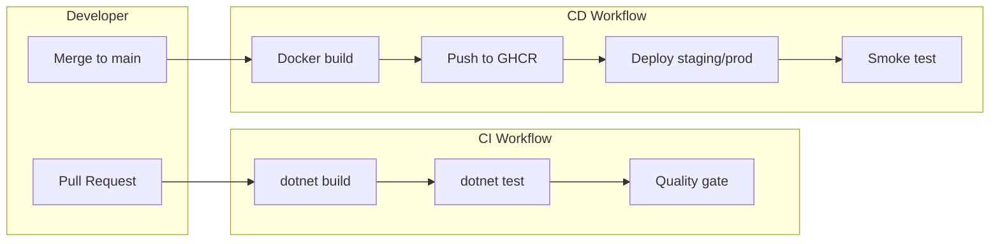

# Release Pipeline Lab

A hands-on CI/CD learning project: a small .NET API, automated tests, Docker, and GitHub Actions pipelines you can show in interviews.

> **Interview line:** "I've been doing CI/CD in production at work, and here's a reference implementation I built."

## What you'll learn

| Step | Topic | Doc |
|------|--------|-----|
| 0 | Setup & learning path | [docs/00-learning-path.md](docs/00-learning-path.md) |
| 1 | .NET app + release endpoints | [docs/01-dotnet-app.md](docs/01-dotnet-app.md) |
| 2 | Automated tests as quality gates | [docs/02-automated-testing.md](docs/02-automated-testing.md) |
| 3 | Docker containerization | [docs/03-docker-containerization.md](docs/03-docker-containerization.md) |
| 4 | GitHub Actions CI | [docs/04-github-actions-ci.md](docs/04-github-actions-ci.md) |
| 5 | GitHub Actions CD (Docker + deploy) | [docs/05-github-actions-cd.md](docs/05-github-actions-cd.md) |
| 6 | Deployment (simulated + Azure) | [docs/06-deployment.md](docs/06-deployment.md) |
| 7 | Interview stories | [docs/07-interview-stories.md](docs/07-interview-stories.md) |
| 8 | Resume positioning | [docs/08-resume-positioning.md](docs/08-resume-positioning.md) |

## Quick start

**Prerequisites:** [.NET 8 SDK](https://dotnet.microsoft.com/download), [Docker](https://docs.docker.com/get-docker/) (optional for local container runs)

```bash
# Clone and enter the repo
cd ci-cd

# Restore, build, test
dotnet restore
dotnet build --configuration Release
dotnet test --configuration Release

# Run locally
dotnet run --project src/ReleasePipeline.Api

# Open http://localhost:5080/health
# Open http://localhost:5080/api/release-info
# With Postgres running: http://localhost:5080/api/deployments
```

**Database integration tests (optional locally):**

```bash
docker compose up postgres -d
export ConnectionStrings__Default="Host=localhost;Port=5432;Database=release_pipeline;Username=app;Password=app"
dotnet test --configuration Release
```

Without Postgres, non-database tests still run; database tests are skipped automatically.

**Docker:**

```bash
docker compose up --build
# http://localhost:8080/health
# http://localhost:8080/api/deployments
```

## Pipeline architecture



## Repository layout

```
ci-cd/
├── .github/workflows/
│   ├── ci.yml          # Build + test on every PR/push
│   └── cd.yml          # Docker build/push + deploy
├── docs/               # Step-by-step lessons
├── src/ReleasePipeline.Api/
├── tests/ReleasePipeline.Api.Tests/
├── scripts/init-test-db.sql
├── Dockerfile
├── docker-compose.yml
└── ReleasePipeline.sln
```

## Publish to GitHub

1. Create a new public repo on GitHub (e.g. `release-pipeline-lab`).
2. Push this project:

```bash
git init
git add .
git commit -m "Initial CI/CD learning project"
git branch -M main
git remote add origin https://github.com/YOUR_USER/release-pipeline-lab.git
git push -u origin main
```

3. After push, open **Actions** tab — CI and CD workflows run automatically.
4. Package appears at `ghcr.io/YOUR_USER/release-pipeline-api`.

## Azure deploy (optional)

See [docs/06-deployment.md](docs/06-deployment.md) for App Service setup and required secrets:

- `AZURE_WEBAPP_NAME`
- `AZURE_WEBAPP_PUBLISH_PROFILE`
- `AZURE_WEBAPP_URL` (for smoke tests)

Trigger with **Actions → CD → Run workflow → deploy_target: azure**.

## License

MIT — use freely for learning and portfolio.
