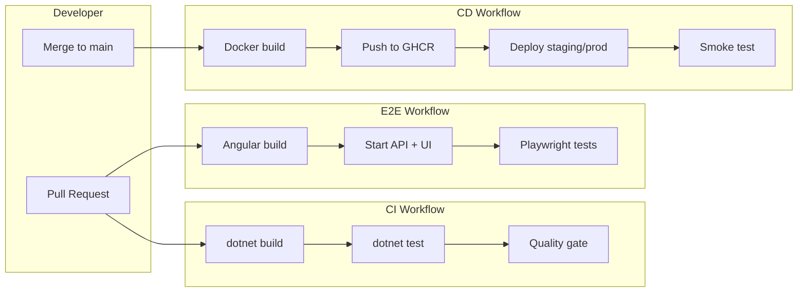

## Quick start

**Prerequisites:** [.NET 8 SDK](https://dotnet.microsoft.com/download), [Node.js 22+](https://nodejs.org/), [Docker](https://docs.docker.com/get-docker/) (optional for local container runs)

```bash
# Clone and enter the repo
cd ci-cd

# Restore, build, test (.NET)
dotnet restore
dotnet build --configuration Release
dotnet test --configuration Release

# Build Angular UI
cd src/ReleasePipeline.UI && npm ci && npm run build && cd ../..

# Run API locally (serves the dashboard UI)
dotnet run --project src/ReleasePipeline.Api

# Open http://localhost:5080 — full dashboard
# Open http://localhost:5080/health
# Open http://localhost:5080/swagger (API docs)
```

**E2E tests (Playwright):**

```bash
cd tests/ReleasePipeline.UI.E2E
npm ci
npx playwright test
```

**Database integration tests (optional locally):**

```bash
docker compose up postgres -d
export ConnectionStrings__Default="Host=localhost;Port=5432;Database=release_pipeline;Username=app;Password=app"
dotnet test --configuration Release
```

Without Postgres, non-database tests still run; database tests are skipped automatically.

**Docker:**

```bash
docker compose up --build
# http://localhost:8080/health
# http://localhost:8080/api/deployments
```

## Pipeline architecture



## Repository layout

```
ci-cd/
├── .github/workflows/
│   ├── ci.yml          # Build + unit/integration tests on every PR/push
│   ├── e2e.yml         # Playwright E2E tests (Angular UI + API)
│   └── cd.yml          # Docker build/push + deploy
├── docs/               # Step-by-step lessons
├── src/
│   ├── ReleasePipeline.Api/    # .NET 8 minimal API
│   └── ReleasePipeline.UI/     # Angular 18 dashboard
├── tests/
│   ├── ReleasePipeline.Api.Tests/  # xUnit integration tests
│   └── ReleasePipeline.UI.E2E/    # Playwright browser tests
├── scripts/init-test-db.sql
├── Dockerfile           # Multi-stage: Angular + .NET
├── docker-compose.yml
└── ReleasePipeline.sln
```

## Publish to GitHub

1. Create a new public repo on GitHub (e.g. `release-pipeline-lab`).
2. Push this project:

```bash
git init
git add .
git commit -m "Initial CI/CD learning project"
git branch -M main
git remote add origin https://github.com/YOUR_USER/release-pipeline-lab.git
git push -u origin main
```

3. After push, open **Actions** tab — CI and CD workflows run automatically.
4. Package appears at `ghcr.io/YOUR_USER/release-pipeline-api`.

## Azure deploy (optional)

See [docs/06-deployment.md](docs/06-deployment.md) for App Service setup and required secrets:

- `AZURE_WEBAPP_NAME`
- `AZURE_WEBAPP_PUBLISH_PROFILE`
- `AZURE_WEBAPP_URL` (for smoke tests)

Trigger with **Actions → CD → Run workflow → deploy_target: azure**.

## License

MIT — use freely for learning and portfolio.
