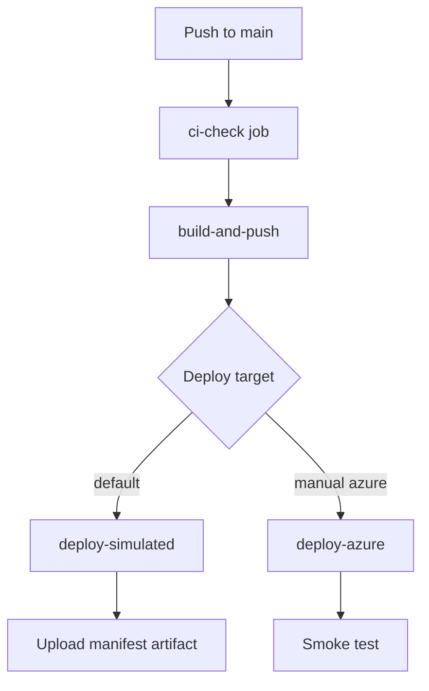

# Lesson 5: GitHub Actions CD

## Goal

Automate **Docker build, registry push, and deployment** after code lands on `main`.

## Workflow file

`.github/workflows/cd.yml`

## Pipeline flow



## Job 1: Docker build and push

Uses [GitHub Container Registry](https://docs.github.com/en/packages/working-with-a-github-packages-registry/working-with-the-container-registry) (GHCR):

```
ghcr.io/YOUR_USER/release-pipeline-api:abc1234
ghcr.io/YOUR_USER/release-pipeline-api:latest
```

### Permissions

```yaml
permissions:
  contents: read
  packages: write
```

`GITHUB_TOKEN` authenticates to GHCR — no extra secret needed for public repos.

### Image tagging strategy

| Tag | When |
|-----|------|
| `latest` | Default branch only |
| `<git-sha>` | Every build — immutable, traceable |

**Best practice:** deploy by SHA tag, not `latest`, in production.

## Job 2: Simulated deploy

Runs automatically on push to `main`. Writes `deployment-manifest.json`:

```json
{
  "service": "release-pipeline-api",
  "environment": "staging",
  "image": "ghcr.io/.../release-pipeline-api:abc1234",
  "git_sha": "abc1234...",
  "deployed_at": "2026-06-26T12:00:00Z",
  "status": "success"
}
```

Download from **Actions → CD run → Artifacts**.

This proves you understand deploy orchestration even without Azure credits.

## Job 3: Azure deploy (optional)

Triggered manually:

**Actions → CD → Run workflow → deploy_target: azure**

Requires secrets (see lesson 6).

## Make package public

After first CD run:

1. Go to your GitHub profile → **Packages**
2. Open `release-pipeline-api`
3. Package settings → Change visibility to **Public**

Recruiters can `docker pull` your image.

## Check yourself

- Why separate CI and CD workflows vs one monolithic file?
- What happens if Docker push succeeds but deploy fails?
- How would you implement rollback?

## Stretch goals

- Add `workflow_run` trigger so CD only runs after CI succeeds on same SHA
- Implement blue/green deploy with two App Service slots
- Add Slack/Teams notification on deploy success/failure

## Next step

→ [Lesson 6: Deployment](06-deployment.md)
